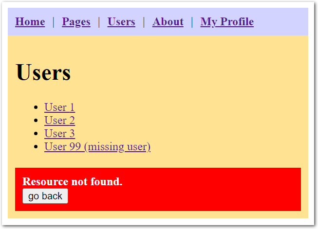

# React Router Example

A simple React Router v6 example app. Uses styled-components for CSS.

## Dependencies

- Vite 6.0
- React 18.3
- react-router-dom 6.28
- styled-components 5.3

## Install

```shell
npm install
```

## Running development server

```shell
npm run dev
```

Open http://localhost:5173.

## Building and running a production version

```shell
npm run build
npm run preview
```

Open http://localhost:4173.

## Screenshots



